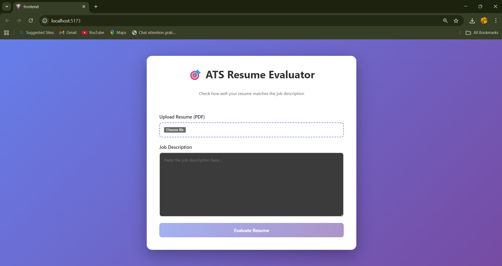
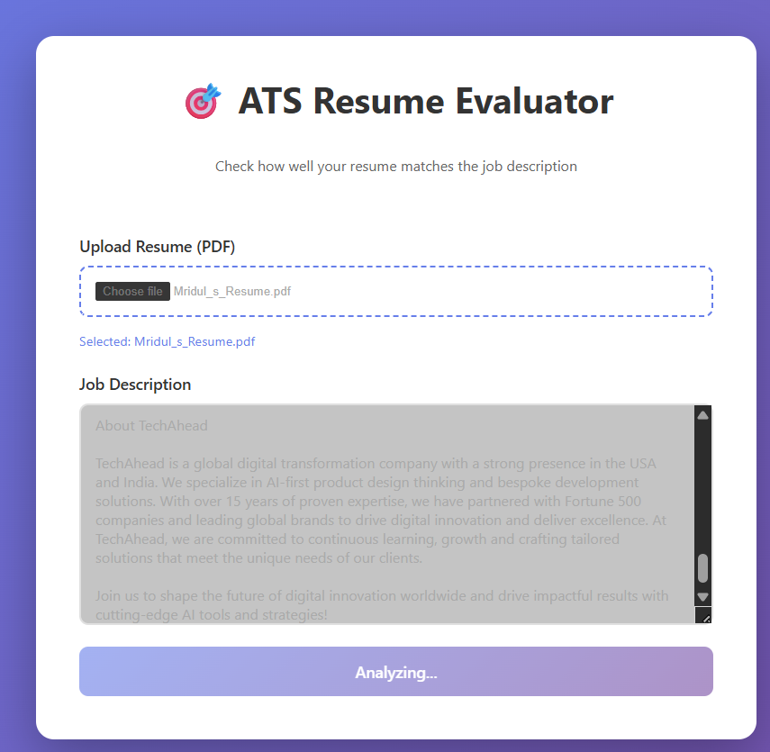

# ATS Full Stack – Resume Evaluator

A **full‑stack ATS (Applicant Tracking System) Resume Evaluator** that analyzes resumes against a job description and returns an ATS compatibility score with insights. The system uses **Django REST Framework** for the backend, **React (Vite)** for the frontend, and **Hugging Face / LLM-based NLP** for semantic analysis.

---

## 🚀 Features

* Upload resume (PDF)
* Paste job description
* NLP-based semantic matching using **Hugging Face models**
* Keyword & section analysis
* ATS compatibility score
* Clean, fast UI built with **React + Vite**
* REST APIs using **Django REST Framework**
* No permanent database dependency for scoring (quick analysis)

---

## 🧠 How It Works (High Level)

1. **User uploads resume + job description** from the React UI
2. **Frontend sends data to Django REST API**
3. **Backend extracts text from PDF**
4. **Hugging Face models** compute semantic similarity
5. ATS score & insights are generated
6. **Result is returned to frontend** and displayed visually

---

## 🏗️ Tech Stack

### Frontend

* **React**
* **Vite** (fast dev server & build)
* CSS (custom styling)

### Backend

* **Django**
* **Django REST Framework**
* Python

### AI / NLP

* **Hugging Face Transformers**
* Semantic similarity models
* Keyword extraction

---

## 📂 Project Structure

```
ATS-Full-STack
│
├── ats_backend
│   ├── ats_backend
│   ├── core
│   │   ├── views.py
│   │   ├── hf_evaluator.py
│   │   ├── utils
│   │   │   └── resume_parser.py
│   └── manage.py
│
├── frontend
│   ├── src
│   │   ├── components
│   │   │   └── ResumeEvaluator.jsx
│   │   └── App.jsx
│   └── vite.config.js
│
└── README.md
```

---

## 🤖 Hugging Face Integration

The backend uses **Hugging Face models** to:

* Convert resume and job description into embeddings
* Measure **semantic similarity**
* Identify missing keywords and strengths

Example usage (simplified):

```python
from transformers import pipeline

classifier = pipeline("feature-extraction", model="sentence-transformers/all-MiniLM-L6-v2")
```

These embeddings are compared to calculate the ATS score.

---

## 🖥️ UI Flow (Screenshots)

### 1️⃣ Resume & Job Description Input

User uploads resume and enters job description.



---

### 2️⃣ Resume Analysis in Progress

AI processes the resume using NLP models.



---

### 3️⃣ Final ATS Score & Insights

Displays ATS score, strengths, and improvement areas.


---

## ▶️ How to Run Locally

### Backend

```bash
cd ats_backend
python -m venv myEnv
myEnv\Scripts\activate
pip install -r requirements.txt
python manage.py runserver
```

### Frontend

```bash
cd frontend
npm install
npm run dev
```

Frontend runs on: `http://localhost:5173`
Backend runs on: `http://127.0.0.1:8000`

---

## 🔐 Environment Variables

Create a `.env` file (ignored by Git):

```
HF_API_KEY=your_huggingface_key
```

---

## ⚠️ Notes

* `__pycache__`, `.env`, `node_modules`, and media files are ignored via `.gitignore`
* This project focuses on **fast ATS scoring**, not long-term storage

---

## 📌 Future Improvements

* Multi‑resume comparison
* Skill gap recommendations
* Export ATS report as PDF
* Authentication & user dashboard

---

## 👨‍💻 Author

**Mridul Kaushik**
GitHub: [https://github.com/MridulKaushik3](https://github.com/MridulKaushik3)

---

⭐ If you like this project, give it a star!
